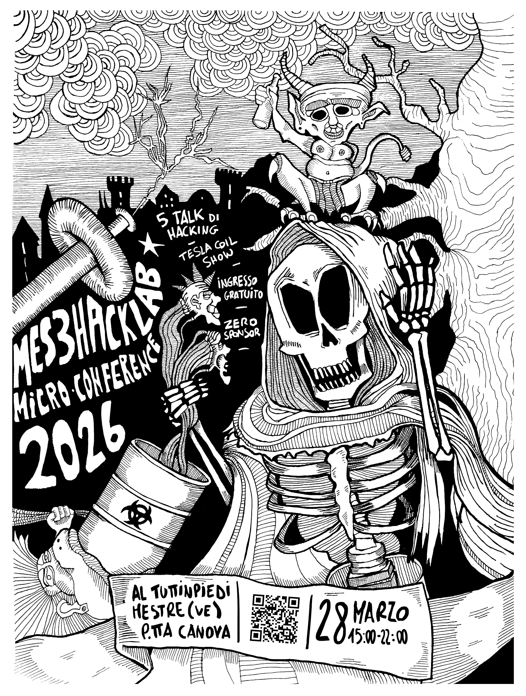

# mes3hacklab micro-conference 2026

`date`: 2026-03-28  
`location`: Mestre  
`time`: 15:00-22:00  
`status`: closed

## summary

Una giornata nata per ritrovarsi dal vivo, rimettere in circolo idee,
persone e discussioni, e riportare continuità attorno alla community.

## lineup

### Epto — 16:00 -> 16:40
**Smart City**

Grande Fratello o nuovo livello della mania di controllo digitale?
Come l'innovazione trasforma i nostri smartphone in cavalli di troia.

### savillum aka Vincenzo — 17:00 -> 17:40
**Blinding the Watchers: Tecniche di Evasione degli EDR dal 2020 al 2025**

Le soluzioni EDR sono diventate il pilastro della difesa endpoint,
ma negli ultimi cinque anni le tecniche per aggirarle si sono evolute
radicalmente. Il talk offre una vista del panorama di evasione EDR dal
2020 al 2025: dall'unhooking e i direct syscall delle origini, fino alle
tecniche più recenti come il call stack spoofing, la sleep obfuscation,
il BYOVD e la generazione polimorfica assistita da AI.

### Michele Pietravalle — 18:00 -> 18:40
**Come sopravvivere a un DDOS**

...di 15 giorni e uscire comunque fuori a bere la sera per dimenticare.

### Rocco Sicilia — 19:00 -> 19:40
**Ingresso vietato**

Per alcune tipologie di organizzazioni esiste un forte squilibrio tra
la probabilità di successo di un attacco informatico condotto
esclusivamente sul piano digitale e quella di un attacco che preveda
l'accesso fisico alla rete aziendale.

In molti casi, partire da un qualsiasi punto interno della rete consente
di aggirare numerosi controlli di sicurezza implementati
dall'organizzazione e di ottenere una posizione persistente con uno
sforzo relativamente ridotto rispetto a quanto richiesto da un attacco
condotto unicamente da remoto.

### ShotokanZH — 22:00 -> ?
**Snado & Cultural Appropriation**

🍕pid

### Epto — 22:00 -> ?
**Urbex**

Lasciate solo impronte, prendete solo emozioni.

## special

### VoltagePyromania — 20:00 -> 22:00
**live tesla coils**

VoltagePyromania è un affascinante progetto musicale che utilizza Tesla
Coils per creare melodie attraverso spettacolari scariche elettriche ad
alta tensione. Questa forma d'arte unica trasforma l'elettricità in
ritmi e note, senza ricorrere a tradizionali amplificatori o
altoparlanti.

Una sinfonia di fulmini controllati che unisce scienza e arte in
un'esperienza audiovisiva elettrizzante che stupisce e incanta il
pubblico.

Michele Pietravalle costruisce Tesla Coil dall'età di 15 anni e, dopo
oltre 25 anni di passione e sperimentazione, ha portato le sue bobine a
livelli sempre più evoluti in termini di tipologia e potenza. La sua
ricerca lo ha condotto a dar vita a VoltagePyromania, un progetto
musicale e scenico che unisce fulmini ed elementi di fuoco in
un'esperienza artistica unica e immersiva.

Archivio link: [micro-conference-2026.html](archive/micro-conference-2026.html) 

## flyer
::gallery

::