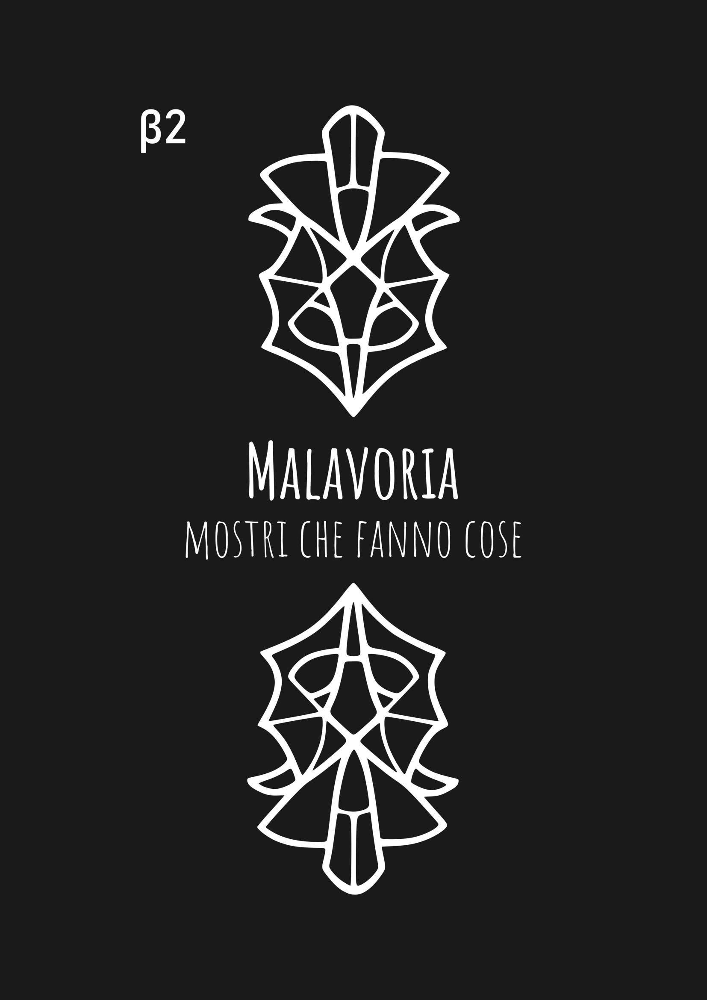
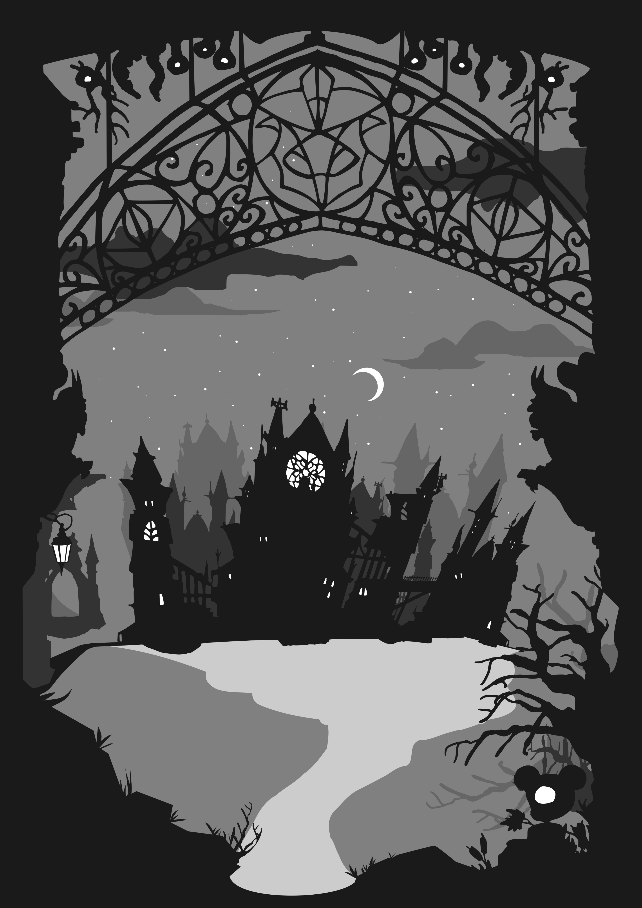
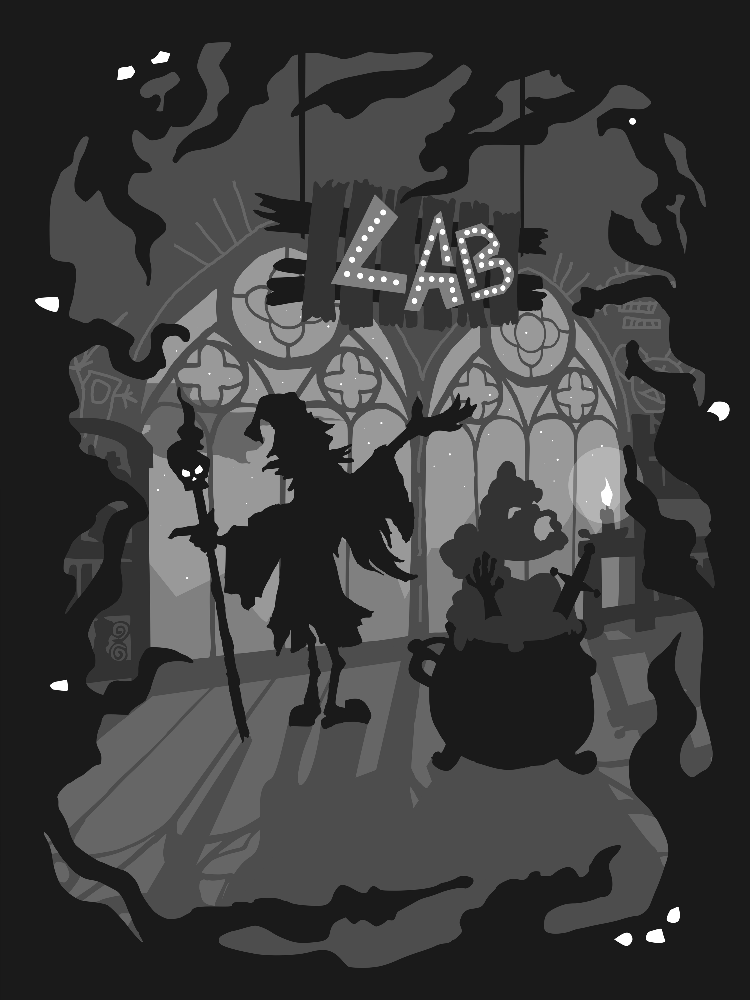
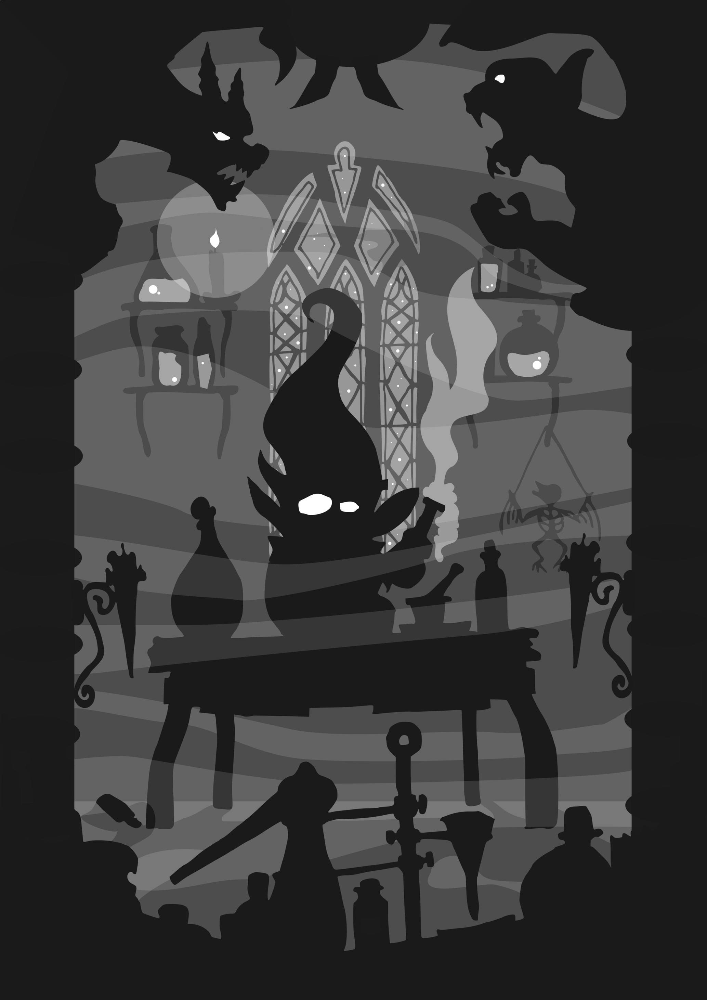
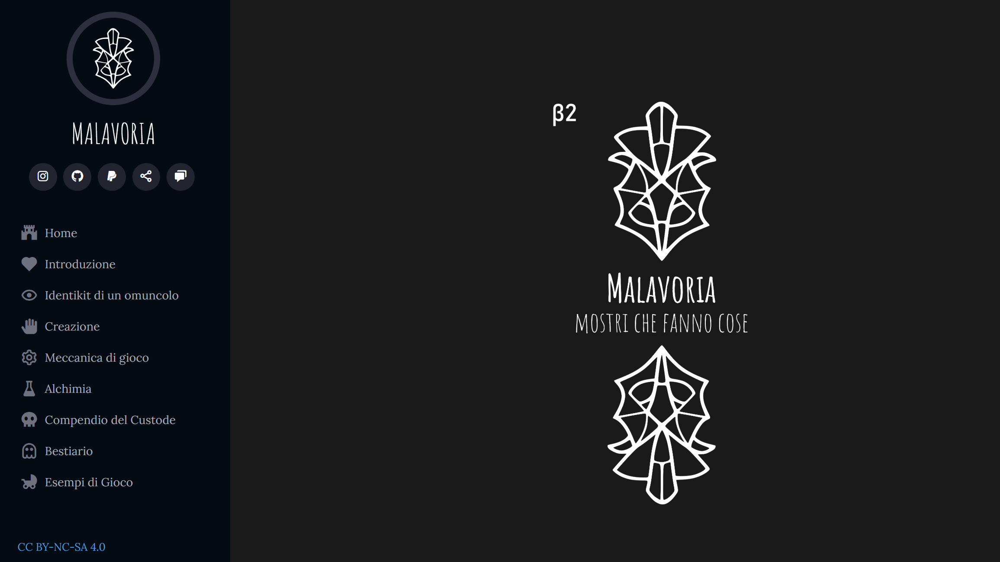

# Malavoria TTRPG
## Tabletop Roleplaying Game

Negli ultimi anni è diventato sempre più evidente perché esista un bisogno reale di giochi di ruolo **open source** o, più in generale, **open game**: quando regole, licenze e possibilità di pubblicare restano nelle mani di pochi soggetti privati, un intero ecosistema creativo può ritrovarsi improvvisamente fragile. 

Il caso più noto è stato quello di **Wizards of the Coast**, quando il tentativo di rimettere in discussione gli equilibri costruiti attorno alla **Open Game License** ha mostrato quanto anche un hobby percepito come “evasione” dipenda in realtà da rapporti di potere e da teste di cazzo. La risposta della comunità e di molti editori è stata la nascita dell’**ORC License**, pensata come alternativa più solida e indipendente. È stato un passaggio importante: ha ricordato che anche i giochi possono rivelare una dimensione inevitabilmente **politica**. 

Il gioco di ruolo presentato qui, `Malavoria`, nasce anche dentro questa esigenza: quella di immaginare spazi creativi più aperti, condivisi e meno ricattabili. Progetto nato nel `2017` da `emme`,  cerca di essere gioco di ruolo semplice, dal ritmo veloce e con personaggi insoliti. Ma soprattutto open.

All'atto pratico è un sito web organizzato come un manuale di gioco liberamente consultabile, pubblicato con licenza Creative Commons BY-NC-SA 4.0.

Il progetto, anche se ampiamente giocabile, è *ancora in fase di sviluppo* e cerca beta tester.

`Link`: [malavoria.com](https://malavoria.com)
`Lingua`: IT

## media

::gallery

::