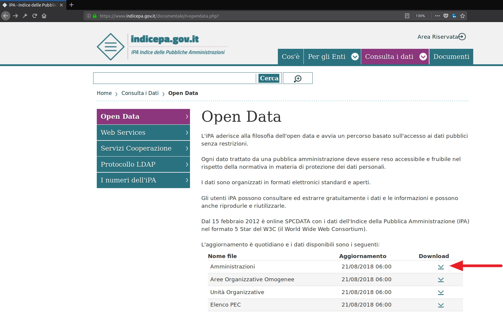
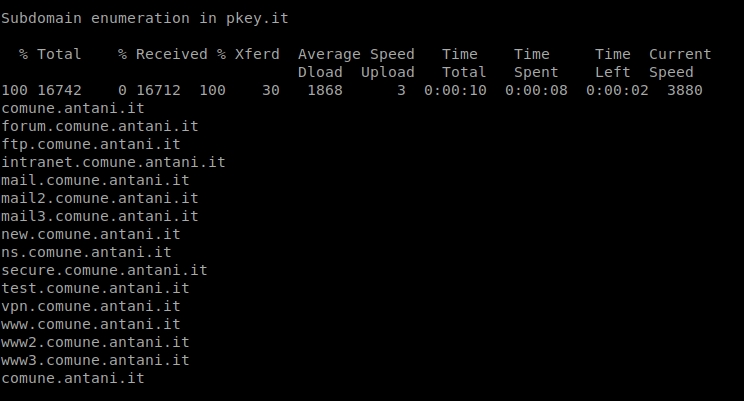
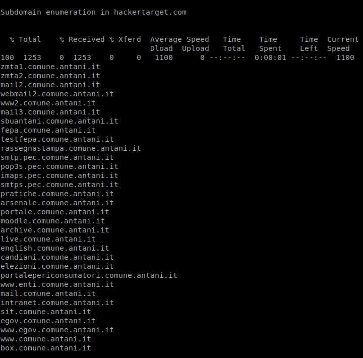
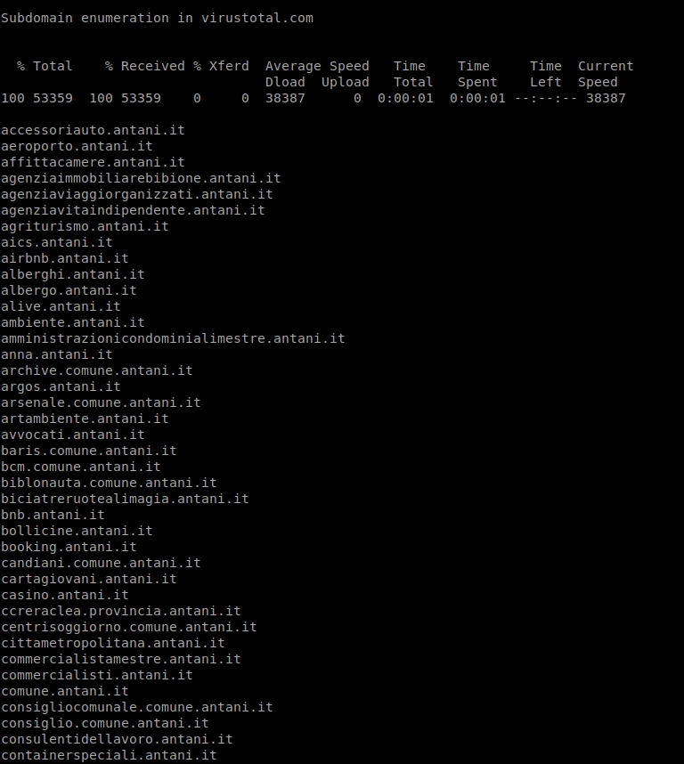
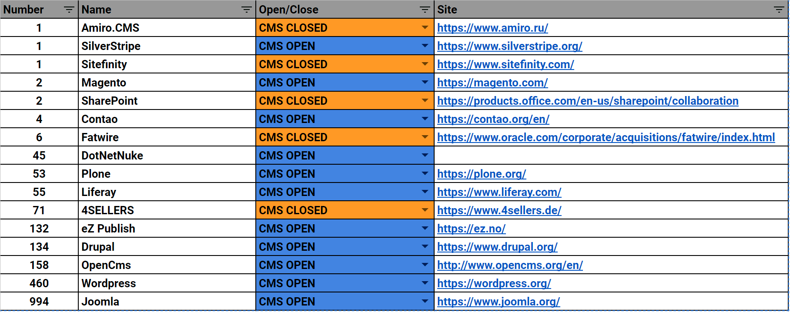
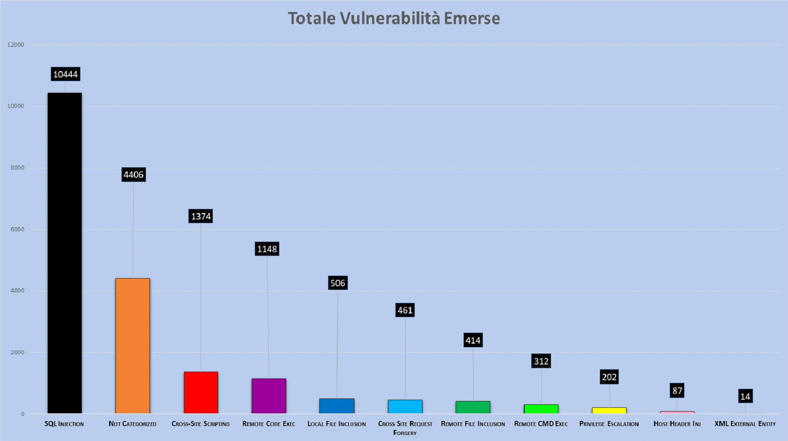

# Osservatorio sulla sicurezza del Web nella PA Italiana

Vuln Scan di +10.000 siti della pubblica amministrazione italiana.

Padova, Parco della Fenice – Dal 2 al 5 di agosto 2018 è stato ospitato probabilmente il miglior hacker camp italiano di sempre. Durante l’evento ci sono stati molti talk uno dei quali proposto dal mes3hacklab di cui sono membro e dove ho partecipato attivamente come speaker.

Il talk in questione si intitolava: [Vuln Scan di +10.000 siti della pubblica amministrazione italiana: Osservatorio sulla sicurezza del Web nella PA Italiana](https://www.ihc.camp/event/italian-hacker-camp-2018-08-02-2018-08-05-1/track/vuln-scan-di-10-000-siti-della-pubblica-amministrazione-italiana-osservatorio-sulla-sicurezza-del-web-nella-pa-italiana-136)

## Ha inizio la storia

“Sono qui per raccontarvi una storia” così ha cominciato il talk Marco ‘b3rito’ Mehanna, e oggi sono qui per raccontarvi questa storia ma soprattutto per condividere con voi in modo più uniforme i dettagli esposti durante il talk.

Il nostro obiettivo era quello di eseguire un vulnerability scan e analizzarne i risultati.

Ci siamo chiaramente fermati alla sola analisi di vulnerabilità, senza in alcun modo andare oltre (fase di exploitation).

## **Subdomain Enumeration**

Il primo passo è stato quello di enumerare tutti i domini dei comuni italiani. Non è stato semplice in quanto gli stessi non rispettavano un pattern specifico che potessimo seguire e spesso ci siamo trovati davanti a domini che potevano sembrare appartenenti alla PA, ma non lo erano.

Grazie al consiglio di Naif abbiamo usato una lista dei domini comunali italiani, che la stessa PA fornisce pubblicamente sotto forma di open data, evitando così il rischio di andare ***out of scope***.

Una volta ottenuti i domini dovevamo cercare per ciascuno di essi i sottodomini correlati. Per farlo abbiamo testato diversi servizi online ma alla fine abbiamo deciso di concentrarci su Virustotal perché è il servizio che enumera più sottodomini.

---

---

---

In aggiunta abbiamo fatto un *bruteforcing* manuale di una piccola lista dei sottodomini più comuni per non perderci nessun elemento potenzialmente vulnerabile.

Terminata l’enumerazione dei domini dovevamo eseguire un’operazione di [***fingerprinting***](https://www.owasp.org/index.php/Fingerprint_Web_Application_Framework_(OTG-INFO-008)) delle tecnologie utilizzate. Volevamo però concentrarci maggiormente sui CMS, visto che è la tecnologia più utilizzata dai comuni.

Abbiamo, con successo, usato diversi*** tool open source*** e online per tentare di identificare tali CMS, anche se si sono presentati alcuni falsi positivi.

Il totale è più basso di quanto dichiarato nel titolo del talk, perchè ci siamo concentrati solo su domini e sottodomini dei comuni italiani che utilizzavano un ***CMS***

Qui di seguito il numero dei CMS identificati:

|  |  |
|---|---|
| **Totale CMS** | **2119** |
| **CMS Open** | **96.18%** |
| **CMS Closed** | **3.82%** |

Come potete vedere ci sono molti CMS ***open source*** e un numero inferiore di soluzioni proprietarie.

## **Vulnerability Scan**

Una volta completata l’intera identificazione dei CMS, abbiamo deciso di concentrarci sui seguenti 3:

- WordPress
- Joomla
- Drupal

Per la fase di ***vulnerability scan*** ci siamo lanciati subito su WordPress e Joomla perché la community ***open source*** offriva dei tools già pronti (wpscan e joomscan rispettivamente creati da Sucuri e da OWASP) con un ottimo ***vulnerability DB*** alle spalle.

Questi tools sono stati utilizzati per fare ***enumeration*** non solo delle versioni dei core ma anche di tutti i plugin identificabili, fornendoci ottimi risultati.

Il terzo CMS che abbiamo preso in esame è stato Drupal che purtroppo non ha a disposizione nessun tool che si appoggi a un ***vulnerability DB***.

Pertanto abbiamo usato svariati tools per l’enumerazione della versione core di drupal ma non siamo riusciti a eseguire l’enumerazione dei plugin (anche per motivi di tempo).

Malgrado non fossimo riusciti a eseguire l’enumeration dei plugin di drupal, le versioni di core risultano comunque molto vulnerabili, soprattutto alle [***drupalgeddon***](https://blog.rapid7.com/2018/04/27/drupalgeddon-vulnerability-what-is-it-are-you-impacted/).

## **Reporting**

Completate tutte le scansioni, abbiamo cercato di raccogliere i dati e presentarli in modo che si potesse percepire la gravità di alcune situazioni.

Qui di seguito il grafico più significativo, che mostra alcune delle vulnerabilità dai noi categorizzate, raccolte dalle nostre scansioni.

Abbiamo diviso in due diverse categorie Remote Code Execution e Remote Command Execution perchè i ***vulnerability DB*** le categorizzavano in questo modo. Queste due vulnerabilita sono più comunemente conosciute come RCE

Durante il talk ho analizzato questo grafico da un punto di vista di gravità delle vulnerabilità, cercando di far percepire quando sia il vero livello di rischio, che è più alto di quanto ci si possa aspettare.

Intanto, come potete vedere, la vulnerabilità con il numero di occorrenze più elevato è la SQL Injection, che la[*** OWASP Top 10***](https://www.owasp.org/index.php/Category:OWASP_Top_Ten_Project) definisce come più comune. Questo tipo d’informazione ci ha anche dato confidenza sulla correttezza dei nostri test.

Il linea di massima si potrebbe pensare che **_Remote Command Execution_(312)**, [**_Remote Code Execution(1148)_**](https://www.owasp.org/index.php/Command_Injection) e [**_Remote File Inclusion(414)_**](https://www.owasp.org/index.php/Testing_for_Remote_File_Inclusion) siano le più gravi. Questo è vero, ma in questa specifica circostanza ci sono vulnerabilità di pari gravità.

La maggior parte di questi domini è in hosting presso provider, quindi ciò che è veramente importante è che queste macchine contengono solo le informazioni e non un entry point di una LAN su cui fare ***pivoting***. Quindi: vulnerabilità come [***SQLi(10444)***](https://www.owasp.org/index.php/SQL_Injection),[*** LFI(506)***](https://www.owasp.org/index.php/Testing_for_Local_File_Inclusion), [***XXE(14)***](https://www.owasp.org/index.php/XML_External_Entity_(XXE)_Processing) ci possono comunque permettere di ottenere informazioni sensibili potenzialmente contenute all’interno del server.

È innegabile che la gravità delle vulnerabilità appena citate e il livello di accesso che forniscono sia minore di quelle riportate precedentemente ma hanno un cosiddetto business impact molto simile ed elevato.

Un altro fattore di cui ho discusso velocemente sono quelle che io ho chiamato ***Exploit Chain***, riferendomi a dei tipi di exploitation particolare che rendono una privilege escalation grave quanto una ***RCE***.

A questo link è possibile trovare un ottimo esempio di un exploit chain in joomla: [***https://www.exploit-db.com/exploits/40637/***](https://www.exploit-db.com/exploits/40637/)

Questo exploit scritto in python permette di concatenare 3 diverse vulnerabilità per ottenere una ***reverse shell*** sul sistema target.

L’exploit nella prima fase utilizza una vulnerabilità di ***Account Creation*** per creare un account joomla non privilegiato; successivamente utilizza una seconda vulnerabilità di [***Privilege Escalation***](https://www.owasp.org/index.php/Testing_for_Privilege_escalation_(OTG-AUTHZ-003)) che vi permette di elevare l’utente appena creato al livello di “Administrator” (attenzione: non a SuperUser che in joomla è l’utente più privilegiato). In aggiunta*** l’exploit***, una volta ottenuto il cookie di sessione di questo nuovo utente “Administrator”, cerca anche di caricare un file pht con una ***reverse shell*** che in alcune versioni vulnerabili di joomla viene interpretato come un file php.

Una volta lanciato lo script in python, se ***l’exploitation*** funziona con successo, siete passati da attaccante con nessun privilegio all’avere una ***reverse shell*** con i permessi dell’utente del web server (di solito ***www-data***).

Vorrei specificare che non c’è stato modo di verificare la presenza di queste exploit chain, ma ne esistono diverse, raramente note e pronte all’utilizzo come in questo caso. E’ molto facile trovarsi davanti a una situazione simile se stiamo conducendo un penetration test su un CMS abbastanza vecchio.

Le 3 tabelle seguenti mostrano le versioni dei CMS utilizzati. Sono state comunicate alla PA in un’ottica di responsible disclosure.

CERT-PA li ha successivamente pubblicati sul proprio sito: [***https://www.cert-pa.it/web/guest/news?id=11043***](https://www.cert-pa.it/web/guest/news?id=11043)

## **Drupal**

| **Versions** | **Occurrences** | **Percentage for each single version** |
|---|---:|---:|
| 5.2 | 1 | 0.83% |
| 6.10 | 1 | 0.83% |
| 6.15 | 4 | 3.31% |
| 6.19 | 2 | 1.65% |
| 6.22 | 3 | 2.48% |
| 6.25 | 1 | 0.83% |
| 6.28 | 8 | 6.61% |
| 6.30 | 1 | 0.83% |
| 6.31 | 1 | 0.83% |
| 6.33 | 1 | 0.83% |
| 6.35 | 7 | 5.79% |
| 6.37 | 3 | 2.48% |
| 6.38 | 7 | 5.79% |
| 7.21 | 1 | 0.83% |
| 7.22 | 1 | 0.83% |
| 7.29 | 1 | 0.83% |
| 7.43 | 31 | 25.62% |
| 7.56 | 1 | 0.83% |
| 7.58 | 3 | 2.48% |
| 7.59 | 39 | 32.23% |
| 8.5.0 | 4 | 3.31% |
|  | 121 | 100.00% |

## **WordPress**

| **Versions** | **Occurrences** | **Percentage for each single version** |
|---|---:|---:|
| 2.7.1 | 1 | 0.29% |
| 2.9.2 | 1 | 0.29% |
| 3.1.1 | 1 | 0.29% |
| 3.1.2 | 1 | 0.29% |
| 3.4.1 | 1 | 0.29% |
| 3.5.1 | 5 | 1.45% |
| 3.5.2 | 1 | 0.29% |
| 3.6 | 4 | 1.16% |
| 3.7.1 | 1 | 0.29% |
| 3.7.26 | 1 | 0.29% |
| 3.8.1 | 2 | 0.58% |
| 3.8.26 | 2 | 0.58% |
| 3.9 | 2 | 0.58% |
| 4.0.16 | 1 | 0.29% |
| 4.0.23 | 19 | 5.49% |
| 4.1 | 1 | 0.29% |
| 4.1.23 | 6 | 1.73% |
| 4.2.2 | 2 | 0.58% |
| 4.2.20 | 4 | 1.16% |
| 4.2.3 | 1 | 0.29% |
| 4.2.4 | 1 | 0.29% |
| 4.2.5 | 1 | 0.29% |
| 4.3 | 30 | 8.67% |
| 4.3.16 | 7 | 2.02% |
| 4.3.2 | 1 | 0.29% |
| 4.4.1 | 3 | 0.87% |
| 4.4.15 | 5 | 1.45% |
| 4.4.2 | 5 | 1.45% |
| 4.5.14 | 6 | 1.73% |
| 4.5.2 | 3 | 0.87% |
| 4.5.3 | 1 | 0.29% |
| 4.5.4 | 1 | 0.29% |
| 4.6 | 1 | 0.29% |
| 4.6.1 | 2 | 0.58% |
| 4.6.11 | 5 | 1.45% |
| 4.7 | 1 | 0.29% |
| 4.7.10 | 18 | 5.20% |
| 4.7.2 | 1 | 0.29% |
| 4.7.3 | 6 | 1.73% |
| 4.7.4 | 1 | 0.29% |
| 4.7.5 | 4 | 1.16% |
| 4.8 | 42 | 12.14% |
| 4.8.1 | 1 | 0.29% |
| 4.8.2 | 3 | 0.87% |
| 4.8.3 | 2 | 0.58% |
| 4.8.6 | 25 | 7.23% |
| 4.9.1 | 1 | 0.29% |
| 4.9.3 | 15 | 4.34% |
| 4.9.4 | 4 | 1.16% |
| 4.9.5 | 4 | 1.16% |
| 4.9.6 | 89 | 25.72% |
|  | 346 | 100.00% |

## **Joomla**

| **Versions** | **Occurrences** | **Percentage for each single version** |
|---|---:|---:|
| 1.0.0 | 12 | 2.81% |
| 1.5 | 105 | 24.59% |
| 1.5.0 | 1 | 0.23% |
| 1.5.15 | 3 | 0.70% |
| 1.5.2 | 2 | 0.47% |
| 1.5.9 | 1 | 0.23% |
| 1.6 | 1 | 0.23% |
| 2.5.1 | 1 | 0.23% |
| 2.5.11 | 6 | 1.41% |
| 2.5.13 | 2 | 0.47% |
| 2.5.14 | 8 | 1.87% |
| 2.5.16 | 2 | 0.47% |
| 2.5.17 | 7 | 1.64% |
| 2.5.18 | 3 | 0.70% |
| 2.5.19 | 9 | 2.11% |
| 2.5.20 | 1 | 0.23% |
| 2.5.27 | 6 | 1.41% |
| 2.5.28 | 74 | 17.33% |
| 2.5.4 | 1 | 0.23% |
| 2.5.6 | 2 | 0.47% |
| 2.5.7 | 1 | 0.23% |
| 2.5.8 | 14 | 3.28% |
| 2.5.9 | 10 | 2.34% |
| 3.1.1 | 1 | 0.23% |
| 3.1.4 | 1 | 0.23% |
| 3.1.5 | 1 | 0.23% |
| 3.2.1 | 1 | 0.23% |
| 3.2.2 | 1 | 0.23% |
| 3.3.1 | 1 | 0.23% |
| 3.3.3 | 2 | 0.47% |
| 3.3.6 | 3 | 0.70% |
| 3.4.1 | 2 | 0.47% |
| 3.4.2 | 1 | 0.23% |
| 3.4.3 | 3 | 0.70% |
| 3.4.4 | 1 | 0.23% |
| 3.4.6 | 2 | 0.47% |
| 3.4.8 | 3 | 0.70% |
| 3.5.0 | 1 | 0.23% |
| 3.5.1 | 1 | 0.23% |
| 3.6.0 | 2 | 0.47% |
| 3.6.2 | 4 | 0.94% |
| 3.6.4 | 3 | 0.70% |
| 3.6.5 | 23 | 5.39% |
| 3.7.0 | 1 | 0.23% |
| 3.7.2 | 7 | 1.64% |
| 3.7.3 | 4 | 0.94% |
| 3.7.4 | 1 | 0.23% |
| 3.7.5 | 5 | 1.17% |
| 3.8.1 | 3 | 0.70% |
| 3.8.3 | 3 | 0.70% |
| 3.8.4 | 1 | 0.23% |
| 3.8.5 | 6 | 1.41% |
| 3.8.6 | 5 | 1.17% |
| 3.8.7 | 30 | 7.03% |
| 3.8.8 | 32 | 7.49% |
|  | 427 | 100.00% |

L’Osservatorio della Pubblica Amministrazione è un progetto appena iniziato e in via di sviluppo, che speriamo stia veramente aiutando la PA a migliorare la situazione. Periodicamente *rieseguiremo* le scansioni e pubblicheremo i risultati su un sito liberamente consultabile.

Gli script da noi utilizzati non sono ancora stati resi pubblici per motivi di *responsible disclosure*.

Per eventuai domande o suggerimenti potete contattarci all’indirizzo [***info@mes3hacklab.org***](mailto:info@mes3hacklab.org)

Link Talk IHC: [https://youtu.be/u5jibHkRzXA](https://youtu.be/u5jibHkRzXA)
Link articolo AGI: https://www.agi.it/cronaca/news/2018-08-03/sicurezza_siti_comuni_italiani-4236400/

## Chi ha partecipato al progetto?

[***Federico klez Culloca***](https://twitter.com/FedericoCulloca) : Uno dei fondatori del mes3hacklab

[***Marco b3rito Mehanna***](https://twitter.com/b3rito) : Uno dei fondatori del mes3hacklab

[***David her0 Lana***](https://twitter.com/Her0_IT) : Co-Fondatore di Knifesec

[***Edoardo electroxero Novello***](https://twitter.com/knifesec) : Fondatore di Knifesec

[***Alessio Righetz***](https://mes3hacklab.org/en/contacts.html): Un tizo che gira al mes3hacklab