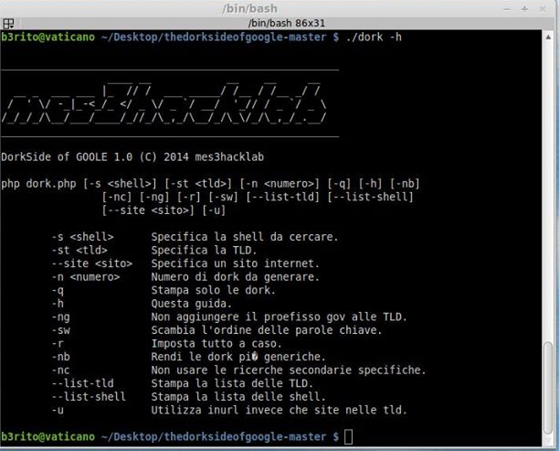
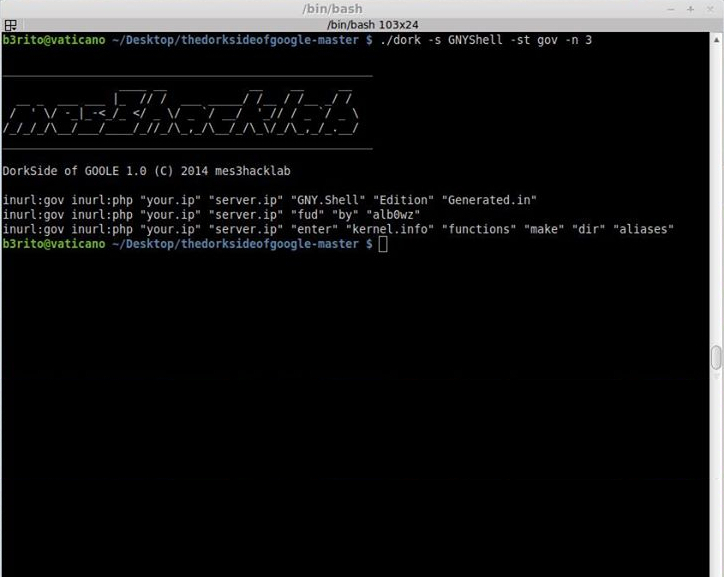
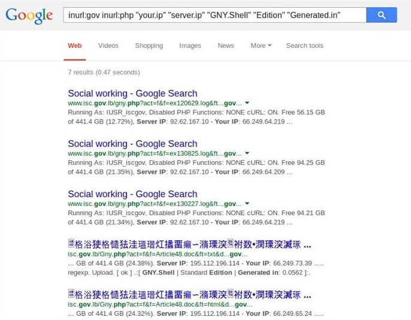

# the dorkside of google

Questo tool svela come, grazie ad una svista di molti “attaccanti” e le mirabolanti peripezie dei Google Dorks, è possibile scoprire tutti i siti che sono vulnerabili ed infettati con le shell più diffuse.

`Github`: [https://github.com/mes3hacklab/thedorksideofgoogle](https://github.com/mes3hacklab/thedorksideofgoogle)
`Slide`:  [thedorksideofgoogle.pdf](docs/thedorksideofgoogle.pdf)

## Gallery

::gallery

::